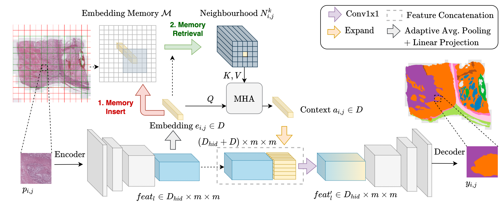

[](https://www.python.org/downloads/release/python-360/)
[](https://github.com/psf/black)

</a>

# Valuing Vicinity

This is the official PyTorch implementation of the WSI segmentation algorithm using the memory attention framework from ["Valuing Vicinity: Memory Attention Framework for Context-Based Semantic Segmentation in Histopathology"][vv_paper_link]  (Oliver Ester, Fabian Hörst, Constantin Seibold, Julius Keyl, Saskia Ting, Nikolaos Vasileiadis, Jessica Schmitz, Philipp Ivanyi, Viktor Grünwald, Jan Hinrich Bräsen, Jan Egger, Jens Kleesiek, arxiv, 2022).

The novel approach compresses patches of WSIs into an embedding memory and enables the model to learn querying the memory for context information in the neighbourhood of each WSI patch using an attention mechanism.

</img>

# Usage

## Training

### Data & Labels

*WSI preprocessing*

To train the model, we first need to extract non-overlapping patches and their masks from the WSIs. The following folder and file structure is expected:
````
dir: <dataset>
    - dir: <wsi_1>
        - dir: patches
            - file: <wsi_1>_<X>_<Y>_<class>.png
            - file: ...
        - dir: masks
            - file: <wsi_1>_<X>_<Y>_mask.npy
            - file: ...
        - dir: metadata
            - file: <wsi_1>_<X>_<Y>_metadata.yml
            - file: ..
    - dir: <wsi_2>
        - ...

    - ...
````

*Patches*:
The folder contains all patch images of one WSI. The patch coordinates `<X>` and `<Y>` must be part of the name to later reference the relative position of the patch in the WSI. The `<class>` number can be provided as the most present class of the patch. The coordinate origin is the top left of the WSI.

The patches can be created with arbitrary downsampling factors - keep in mind that many patches for one WSI will result into a larger embeddig memory which is stored in the VRAM by default.

*Masks*:
For every patch file, there must be its corresponding mask file, following the same naming convention. The mask must be provided as a numpy array holding the pixel class as an integer value in the form of `[[first_row],[second_row]]` - with the first row starting at the top left of each patch.

*Metadata*:
To use the helper loss (predict the class distribution per patch), for each patch we create a YAML meta file of the pixel ratio for every class in the patch - e.g.:
```yml
0: 0.2342071533203125
2: 0.7657928466796875
```

*Label mapping file*

For evalution and visualization, we prepare a label mapping JSON that maps the integer class of each pixel to its semantic meaning:
```json
{
    "background": 0,
    "tumor": 1,
    "healthy": 2
}
```

### Configuration 

To start the model training, you need to provide a YAML configuration file.

### Parameters:
- `arch`: Select the base segmentation model - one of ['unet', 'unetplusplus', 'deeplabv3', 'manet', 'linknet', 'fpn', 'pspnet', 'deeplabv3plus', 'pan'] ([uses PyTorch Segmentation Models][pytorch_seg_model]). Default to 'resnet50'.
- `encoder`: Select the encoder for the base segmentation model - one of ['resnet18', 'resnet50', 'resnet101'] ([uses PyTorch Segmentation Models][pytorch_seg_model]). Default to 'unet'.
- `gpu`: Select the gpu to use. Default to 0.
- `workers`: Select the number of PyTorch data loader workers. Default to 32.
- `nfold`: Select the number of cross validation folds.
- `batch-size`: Select the batch size of WSI patches for the training phase. Default to 512.
- `val-batch-size`: Select batch size of WSI patches for the validation phase. Default to 512.
- `epochs`: Select the maximum number of epochs to train. Default to 100.
- `train-data`: Select the path to folder containing preprocessed WSI patches for training and validation.
- `label-map-file`: Select the path to the label mapping file.
- `draw-patches-per-class`: Select the maximum number of patches to draw for each WSI.
- `vali-split`: Select the ratio of WSI training data to use for validation/early-stopping.
- `learning-rate`: Selelct the initial (base) learning rate. Default to 0.001.
- `lr-gamma`: Select the gamma parameter of exponential learning rate decay. Default to 0.95.
- `adjust-lr`: Set to True to activates exponential learning rate decay. Default to False.
- `merge-classes`: Define a list of pairs of class labels in the format to [[\<target>,\<source>]] to replace the <source> class with the <target> class on-the-fly.
- `normalize`: Set to True to activates transforms.Normalize.
- `logdir`: Select a folder to save training and validation logs to.
- `evaluate-every`: Select after how many epochs the validation set should be evaluated, respectively (Evaluation refers to a complete WSI inference and per-WSI evaluation). Set to 0 to only evaluate the validation set after training has finished.
- `n-eval-wsis`: If `evaluate-every > 0`, select how many WSIs should be evaluted each time. Default to None.
- `warm-up-epochs`: Select after how many epochs early stopping should start. Default to None.
- `early-stopping-epochs`: Select how many epochs early stopping should be patient. Default to None.
- `criterion`: Select the critertion to optimize for - one of ['cross_entropy','focal_tversky', 'dice', 'focal', 'focal+dice', 'focal+focal_tversky', 'ce+dice']. Default to 'cross_entropy'.
- `embedding-dim`: Select the number of embedding dimension of one patch. Also defines the memory dimension. Default to 1024.
- `k-neighbours`: Select the neighourhood radius to query from the embedding memory.
- `use-ln`: Set to True to use layer normalization in the multi-head self-attention (MSA) module. Default to False.
- `emb-dropout`: Select a ratio for embedding dropout in the multi-head self-attention (MSA) module. Default to 0.
- `att-dropout`: Select a ratio for attention dropout in the multi-head self-attention (MSA) module. Default to 0.
- `sin-pos-encoding`: Set to True to activate sinusoidal position encoding. Default to False.
- `learn-pos-encoding`: Set to True to activate learnable 2-d position encoding. Default to False.
- `num-attention-heads`: Select number of attention heads for MSA. Default to 8
- `attention-hidden-dim`: Select number of MSA hidden dimension (after linear projection). Default to 1024. 
- `use-self-attention`: Set to True to allow the query embedding to attend itself - otherwise only attends its neighbourhood. Default to False.
- `seed`: Set a seed. Default to None.
- `augment`: Set to True to apply augmentations to patches.
- `performance-metric`: Select a performance metric for early stopping and model selection - one of ['loss', 'dice']. Default to 'loss'.
- `attention-on`: Set to True to activate attention memory mechanism. Otherwise, base segmentation is performed.
- `fill-in-eval`: Set to True to always fill model in evaluation mode.
- `helper-loss`: Set to True to enable class distribution helper loss. Default to False.
- `combine-weight`: Set ratio of base loss if helper loss is activated.

The folder `configs_paper` contains all configurations that we trained and evaluated for the publication.

### Start Training
Ensure all requirements from the `requirements.txt` file are met.
To start training, run `python main.py --conf_file <path-to-configuration-file>`.

The results will be logged into the `logdir` directory.

## Example

This is an example file for training a `DeeplabV3+MAF` model with `k=8` as neighbourhood radius:

```yml
arch: deeplabv3
encoder: resnet50
gpu: 1
workers: 8
nfold: 5
batch-size: 32
val-batch-size: 256
epochs: 100
train-data: <path-to-patched-wsis>
label-map-file: <path-to-label-mapping>
draw-patches-per-class: 100
vali-split: 0.2
learning-rate: 0.0001
lr-gamma: 0.95
adjust-lr: true
merge-classes: [[10,7]] # cortex, cortex_atrophy
normalize: true
logdir: <foler-to-log-to>
evaluate-every: 0
n-eval-wsis: 5
warm-up-epochs: 5
early-stopping-epochs: 10
criterion: 'cross_entropy'
embedding-dim: 1024
k-neighbours: 8
use-ln: true
emb-dropout: 0
att-dropout: 0
sin-pos-encoding: true
learn-pos-encoding: false
num-attention-heads: 8
attention-hidden-dim: 1024
use-self-attention: false
log-details: false
seed: 13
augment: true
performance-metric: loss
attention-on: true
fill-in-eval: true
helper-loss: true
combine-weight: 0.8
```


[vv_paper_link]: https://arxiv.org/abs/2210.11822
[pytorch_seg_model]: https://github.com/qubvel/segmentation_models.pytorch
